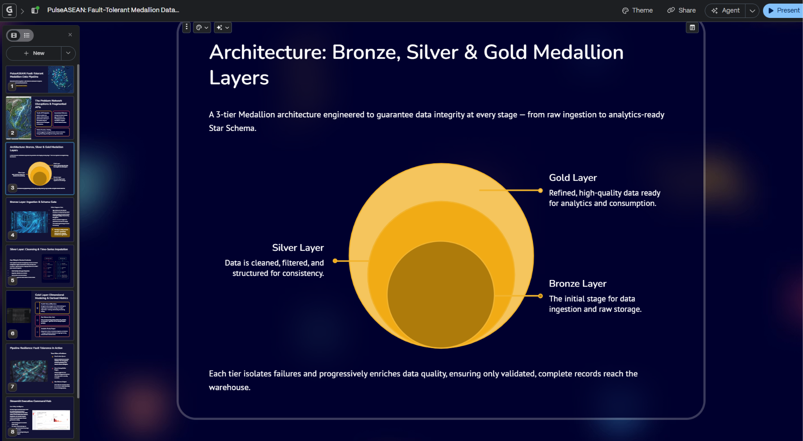
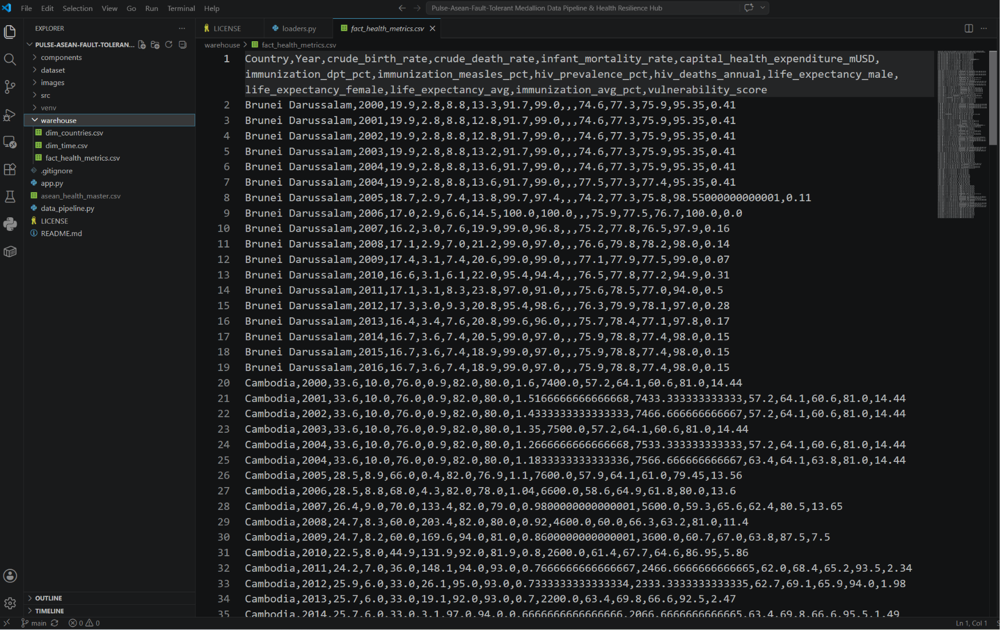
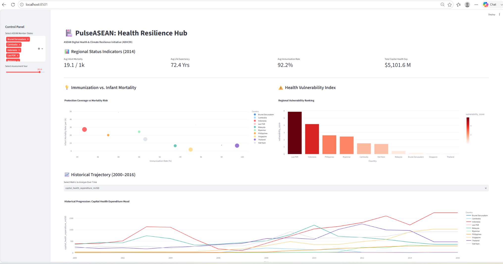

# PulseASEAN: Fault-Tolerant Medallion Data Pipeline

> **Track C: Health Resilience & Regional Data Engineering**  
> *A resilient, multi-tier Medallion data pipeline and Star Schema warehouse designed to process erratic public health metrics across Southeast Asia under severe network disruptions.*

## 📌 Executive Summary

During extreme weather and regional crisis events, public health data feeds across Southeast Asia become highly erratic—resulting in connection drops, missing time-series entries, and corrupt payloads. 

**PulseASEAN** addresses this fragility through a 3-tier Medallion architecture:
1. **Bronze Layer:** Raw data ingestion with schema validation and automated **Dead Letter Queue (DLQ)** isolation.
2. **Silver Layer:** Data cleansing, deduplication, and cross-country **linear gap interpolation** for historical continuity.
3. **Gold Layer:** Computation of composite derived metrics (**Health Vulnerability Index**) and dimensional modeling into an analytics-ready **Star Schema**.

## 🏗️ System Architecture
                  +-----------------------------+
                  | Raw Public Health APIs/Feeds|
                  +--------------+--------------+
                                 |
                                 v
              +----------------------------------+
              |    BRONZE LAYER (Ingestion)      |
              |  - Schema Validation             |
              |  - Type Casting                  |
              +--------+----------------+--------+
                       |
            Valid Records               Malformed Records
                       |
                       v
      +------------------------+   +------------------------+
      |  SILVER LAYER          |   |   DEAD LETTER QUEUE    |
      |  - Linear Interpolation|   |  - Isolated Quarantine |
      |  - Unit Normalization  |   |  - Telemetry Alerts    |
      +-----------+------------+   +------------------------+
                  |
                  v
      +------------------------+
      |    GOLD LAYER          |
      |  - Star Schema Output  |
      |  - Composite HVI Score |
      +-----------+------------+
                  |
                  v
      +------------------------+
      | Executive Dashboard    |
      | (Streamlit Command Hub)|
      +------------------------+

## 🛠️ Medallion Pipeline Breakout

### 1. 🥉 Bronze Layer (Ingestion & Schema Gate)
* Enforces strict type casting and structural validation on incoming raw feeds.
* Schema violations or malformed payloads are quarantined immediately into the **Dead Letter Queue (DLQ)** without halting pipeline execution.
* Emits real-time pipeline telemetry alerts upon error detection.

### 2. 🥈 Silver Layer (Cleansing & Time-Series Imputation)
* Detects and removes duplicate records across reporting windows.
* Applies a **linear interpolation engine** across historical country metrics (2000–2016) to ensure temporal continuity.
* Standardizes reporting units across all ASEAN member states.

### 3. 🥇 Gold Layer (Dimensional Modeling & Star Schema)
* Models cleaned data into an optimized **Star Schema** data mart located in `/warehouse`:
  * `fact_health_metrics.csv`: Core fact table containing metrics and calculated indices.
  * `dim_countries.csv`: Dimensional lookup table for ASEAN state geographical/regional attributes.
  * `dim_time.csv`: Temporal dimension supporting low-latency time-series querying.
* Computes the composite **Health Vulnerability Index (HVI)** derived from infant mortality, life expectancy, immunization coverage, and capital expenditure.

## 📸 Platform Showcase & Artifacts

### 1. Pipeline Architecture & Presentation Deck

*Figure 1: High-level architectural overview and UN SDG alignment from the presentation deck.*

### 2. Gold Layer Star Schema Warehouse (`/warehouse`)

*Figure 2: Physical layout of `/warehouse` dimensional datasets (`fact_health_metrics`, `dim_countries`, `dim_time`) generated by the pipeline.*

### 3. Streamlit Executive Command Hub

*Figure 3: Live executive command hub displaying multi-country trend analysis, KPI metrics, and Health Vulnerability Index rankings.*

## 🚀 Getting Started

### Prerequisites
* Python 3.10+
* `pip` / `venv`

### Installation & Setup

1. **Clone the repository:**
   ```bash
   git clone [https://github.com/Mirrz64/Pulse-Asean.git](https://github.com/Mirrz64/Pulse-Asean.git)
   cd Pulse-Asean
2. **Set up Virtual environment**
   python -m venv venv
   # Windows:
    venv\Scripts\Activate.ps1
   # macOS/Linux:
    source venv/bin/activate
3. **Install dependencies**
   pip install -r requirements.txt
4. **Execute data pipeline**
   python data_pipeline.py
5. **Launch Executive command Hub**
   streamlit run app.py

📊 United Nations SDG Alignment
🏥 SDG 3: Good Health & Well-Being — Empowers evidence-based public health planning using continuous time-series analytics.

⚖️ SDG 10: Reduced Inequalities — Identifies vulnerable regional sectors using composite vulnerability scoring.

🤝 SDG 17: Partnerships for the Goals — Promotes open data engineering practices and cross-border data infrastructure across ASEAN.

👤 Author
Team VEGA

Repository: github.com/Mirrz64/Pulse-Asean-Fault-Tolerant-Medallion-Data-Pipeline-Health-Resilience-Hub
