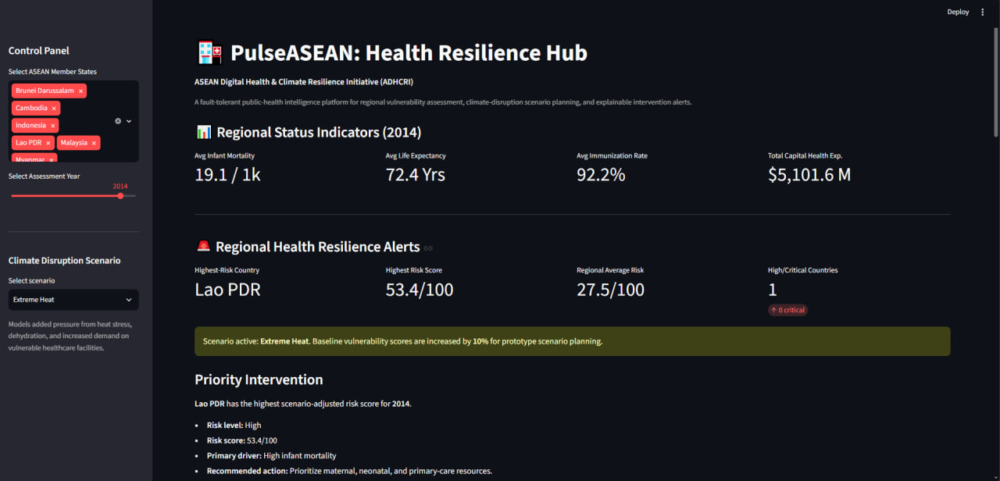
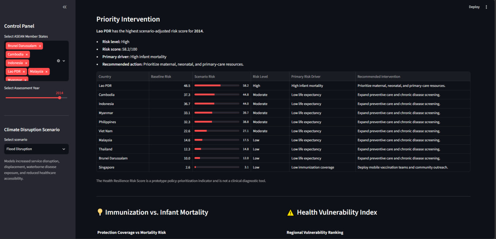
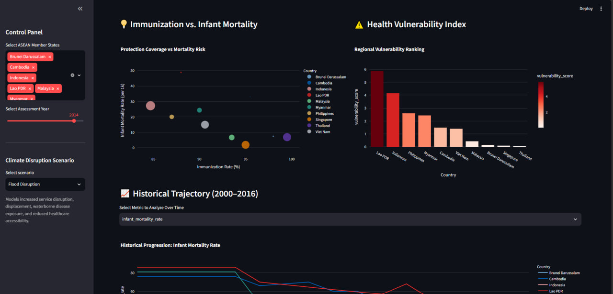
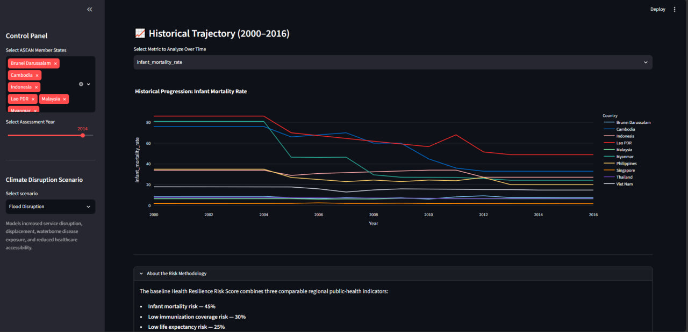

<<<<<<< Updated upstream
# PulseASEAN: Fault-Tolerant Medallion Data Pipeline

> **Track C: Health Resilience & Regional Data Engineering**  
> *A resilient, multi-tier Medallion data pipeline and Star Schema warehouse designed to process erratic public health metrics across Southeast Asia under severe network disruptions.*

## 📌 Executive Summary

During extreme weather and regional crisis events, public health data feeds across Southeast Asia become highly erratic—resulting in connection drops, missing time-series entries, and corrupt payloads. 

**PulseASEAN** addresses this fragility through a 3-tier Medallion architecture:
1. **Bronze Layer:** Raw data ingestion with schema validation and automated **Dead Letter Queue (DLQ)** isolation.
2. **Silver Layer:** Data cleansing, deduplication, and cross-country **linear gap interpolation** for historical continuity.
3. **Gold Layer:** Computation of composite derived metrics (**Health Vulnerability Index**) and dimensional modeling into an analytics-ready **Star Schema**.

## 🏗️ System Architecture
                  +-----------------------------+
                  | Raw Public Health APIs/Feeds|
                  +--------------+--------------+
                                 |
                                 v
              +----------------------------------+
              |    BRONZE LAYER (Ingestion)      |
              |  - Schema Validation             |
              |  - Type Casting                  |
              +--------+----------------+--------+
                       |
            Valid Records               Malformed Records
                       |
                       v
      +------------------------+   +------------------------+
      |  SILVER LAYER          |   |   DEAD LETTER QUEUE    |
      |  - Linear Interpolation|   |  - Isolated Quarantine |
      |  - Unit Normalization  |   |  - Telemetry Alerts    |
      +-----------+------------+   +------------------------+
                  |
                  v
      +------------------------+
      |    GOLD LAYER          |
      |  - Star Schema Output  |
      |  - Composite HVI Score |
      +-----------+------------+
                  |
                  v
      +------------------------+
      | Executive Dashboard    |
      | (Streamlit Command Hub)|
      +------------------------+

## 🛠️ Medallion Pipeline Breakout

### 1. 🥉 Bronze Layer (Ingestion & Schema Gate)
* Enforces strict type casting and structural validation on incoming raw feeds.
* Schema violations or malformed payloads are quarantined immediately into the **Dead Letter Queue (DLQ)** without halting pipeline execution.
* Emits real-time pipeline telemetry alerts upon error detection.

### 2. 🥈 Silver Layer (Cleansing & Time-Series Imputation)
* Detects and removes duplicate records across reporting windows.
* Applies a **linear interpolation engine** across historical country metrics (2000–2016) to ensure temporal continuity.
* Standardizes reporting units across all ASEAN member states.

### 3. 🥇 Gold Layer (Dimensional Modeling & Star Schema)
* Models cleaned data into an optimized **Star Schema** data mart located in `/warehouse`:
  * `fact_health_metrics.csv`: Core fact table containing metrics and calculated indices.
  * `dim_countries.csv`: Dimensional lookup table for ASEAN state geographical/regional attributes.
  * `dim_time.csv`: Temporal dimension supporting low-latency time-series querying.
* Computes the composite **Health Vulnerability Index (HVI)** derived from infant mortality, life expectancy, immunization coverage, and capital expenditure.

## 📸 Platform Showcase & Artifacts

### 1. Pipeline Architecture & Presentation Deck

*Figure 1: High-level architectural overview and UN SDG alignment from the presentation deck.*

### 2. Gold Layer Star Schema Warehouse (`/warehouse`)

*Figure 2: Physical layout of `/warehouse` dimensional datasets (`fact_health_metrics`, `dim_countries`, `dim_time`) generated by the pipeline.*

### 3. Streamlit Executive Command Hub

*Figure 3: Live executive command hub displaying multi-country trend analysis, KPI metrics, and Health Vulnerability Index rankings.*

## 🚀 Getting Started

### Prerequisites
* Python 3.10+
* `pip` / `venv`

### Installation & Setup

1. **Clone the repository:**
   ```bash
   git clone [https://github.com/Mirrz64/Pulse-Asean.git](https://github.com/Mirrz64/Pulse-Asean.git)
   cd Pulse-Asean
2. **Set up Virtual environment**
   python -m venv venv
   # Windows:
    venv\Scripts\Activate.ps1
   # macOS/Linux:
    source venv/bin/activate
3. **Install dependencies**
   pip install -r requirements.txt
4. **Execute data pipeline**
   python data_pipeline.py
5. **Launch Executive command Hub**
   streamlit run app.py

📊 United Nations SDG Alignment
🏥 SDG 3: Good Health & Well-Being — Empowers evidence-based public health planning using continuous time-series analytics.

⚖️ SDG 10: Reduced Inequalities — Identifies vulnerable regional sectors using composite vulnerability scoring.

🤝 SDG 17: Partnerships for the Goals — Promotes open data engineering practices and cross-border data infrastructure across ASEAN.

👤 Author
Team VEGA

Repository: github.com/Mirrz64/Pulse-Asean-Fault-Tolerant-Medallion-Data-Pipeline-Health-Resilience-Hub
=======
# 🏥 PulseASEAN: Health Resilience Hub

**Pod Vega — 10Alytics Global Hackathon 2026**

PulseASEAN is a fault-tolerant public-health intelligence platform designed to help ASEAN policymakers identify vulnerable countries, understand major health-risk drivers, simulate climate-related disruptions, and prioritize interventions.

The solution combines a resilient data pipeline, explainable health-risk scoring, climate scenario analysis, and an interactive Streamlit dashboard.

---

## The Problem

ASEAN’s health systems face several connected challenges:

- Fragmented health data across countries and institutions
- Unequal healthcare access and funding
- Climate-driven disease and infrastructure disruption
- Limited visibility into vulnerable populations
- Unreliable power and internet connectivity in underserved areas
- Difficulty coordinating regional public-health responses

These challenges can delay disease detection, weaken emergency response, and make it harder to allocate limited healthcare resources effectively.

---

## Our Solution

PulseASEAN transforms historical ASEAN health indicators into actionable regional intelligence.

The platform:

- Validates and processes health data through a medallion-style pipeline
- Interpolates missing country-level time-series values
- Quarantines invalid records through a Dead Letter Queue
- Generates an analytical star schema
- Calculates an explainable Health Resilience Risk Score
- Identifies each country’s primary risk driver
- Recommends targeted public-health interventions
- Simulates climate and infrastructure disruption scenarios
- Visualizes regional health patterns and historical trends

---

## Key Features

### Fault-Tolerant Data Pipeline

The pipeline validates incoming records and prevents malformed data from stopping the workflow. Invalid records are redirected to a Dead Letter Queue for further review.

### Explainable Health Resilience Risk Score

The score combines:

| Indicator | Weight |
|---|---:|
| Infant mortality risk | 45% |
| Low immunization coverage risk | 30% |
| Low life expectancy risk | 25% |

Each indicator is normalized before weighting.

Risk levels are classified as Low, Moderate, High, or Critical. The model also provides a primary risk driver, recommended intervention, and country-level ranking.

### Climate Disruption Scenarios

Users can simulate:

- Normal Conditions
- Flood Disruption
- Extreme Heat
- Vector-Borne Disease Surge
- Power and Connectivity Outage

These scenarios apply transparent prototype multipliers to the baseline risk score for planning and demonstration purposes.

### Interactive Dashboard

The Streamlit dashboard includes:

- Regional health indicators
- Country and year filters
- Climate scenario controls
- Highest-risk country
- Regional average risk
- Priority intervention recommendations
- Country-level alert table
- Immunization versus infant mortality analysis
- Historical health trajectories
- Risk methodology and limitations

---

## Dashboard Preview

### Regional Health Resilience Overview



### Country-Level Alerts and Interventions



### Regional Vulnerability Analysis



### Historical Health Trajectory



---

## Architecture

```text
Raw ASEAN Health Data
        │
        ▼
Bronze Layer
Data ingestion and schema validation
        │
        ├── Invalid records → Dead Letter Queue
        │
        ▼
Silver Layer
Cleaning and country-level interpolation
        │
        ▼
Gold Layer
Derived indicators and health-risk scoring
        │
        ▼
Star Schema Warehouse
Fact and dimension tables
        │
        ▼
Streamlit Dashboard
Risk alerts, scenarios, trends, and interventions
```

---

## Technologies Used

- Python
- Pandas
- NumPy
- Streamlit
- Plotly
- Git and GitHub
- Medallion data architecture
- Star-schema data modelling

---

## Running the Project

Clone the repository:

```bash
git clone https://github.com/Mirrz64/Pulse-Asean-Fault-Tolerant-Medallion-Data-Pipeline-Health-Resilience-Hub.git
```

Move into the project folder:

```bash
cd Pulse-Asean-Fault-Tolerant-Medallion-Data-Pipeline-Health-Resilience-Hub
```

Install dependencies:

```bash
pip install -r requirements.txt
```

Run the data pipeline:

```bash
python data_pipeline.py
```

Start the dashboard:

```bash
streamlit run app.py
```

The application will normally open at:

```text
http://localhost:8501
```

---

## SDG Alignment

### SDG 3 — Good Health and Well-Being

- Improved health-risk monitoring
- Better intervention prioritization
- Support for immunization and maternal-health planning

### SDG 10 — Reduced Inequalities

- Identification of countries and communities with higher health vulnerability
- More equitable resource-allocation decisions

### SDG 17 — Partnerships for the Goals

- Regional health-data collaboration
- Cross-border public-health coordination
- Shared analytical standards

---

## Limitations

- The project uses historical health indicators rather than real-time clinical data.
- Climate scenarios use prototype multipliers and are not clinical forecasts.
- The Health Resilience Risk Score is a policy-prioritization tool, not a medical diagnostic model.
- The current prototype does not yet include live climate, geospatial, hospital, or outbreak-surveillance feeds.

---

## Future Improvements

- Integrate live climate and weather data
- Add dengue, malaria, TB, and outbreak-surveillance feeds
- Introduce geospatial hotspot detection
- Add machine-learning outbreak forecasting
- Support FHIR-based health-data interoperability
- Implement role-based access control and audit logging
- Add encrypted offline synchronization for rural health facilities

---

## Team

### Pod Vega

- **Miracle Osabuogbe**
- **Mohammed Usman**

Developed for the **10Alytics Global Hackathon 2026** under the theme:

**Sustainable Development Through Artificial Intelligence and Innovation**

---

## Disclaimer

PulseASEAN is a hackathon prototype intended for public-health analytics and policy-planning demonstrations. It is not a clinical diagnostic system.
>>>>>>> Stashed changes
